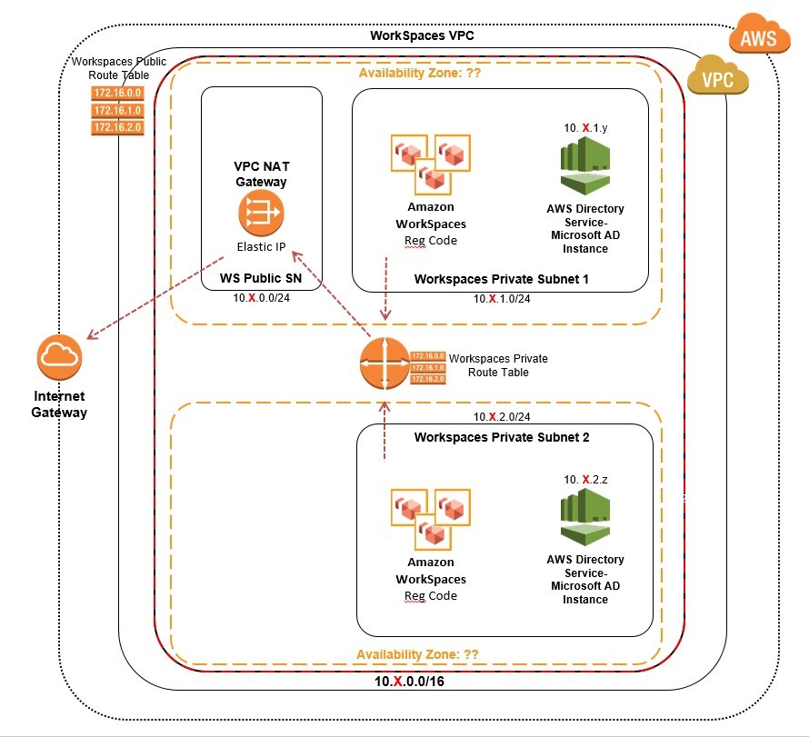

# workspaces-poc

> Tested in
> * ap-southeast-1
> * should work in other service available region

# First Step: Create the WorkSpaces Lab VPC network infrastructure using AWS CloudFormation 
The steps in this section will walk you through running an AWS CloudFormation script to build out a fully functioning Virtual Private Cloud (VPC) infrastructure in the selected region you choose under your AWS account in an automated fashion.

| Components | Value |
| ------------- | ------------- |
| VPC Name  | WorkSpaces VPC  |
| VPC IPv4 CIDR block   | 10.X.0.0/16   Where X is your choice (0-255)  |
| Public subnet name  | WorkSpaces Public Subnet  |

# Second Step: Create an AWS Directory Service
Amazon WorkSpaces requires an AWS Directory Service store to facilitate WorkSpace and user information for authentication and management purposes. The Amazon WorkSpaces managed service can create this directory in the cloud for you using either Simple AD  or AWS Managed Microsoft AD. Additionally, you can connect to an existing Active Directory using the Active Directory Connector (or AWS Managed Microsoft AD via a standard domain trust) through the AWS Directory Services console. 
