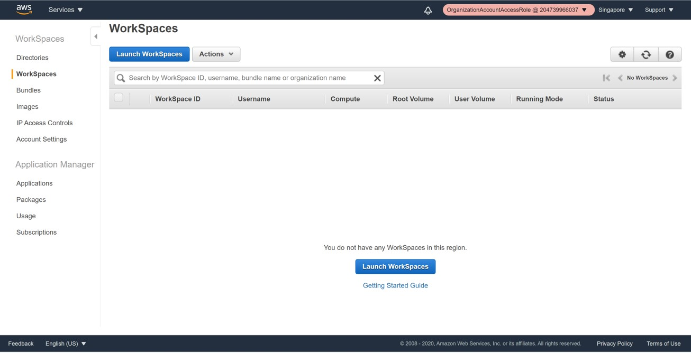
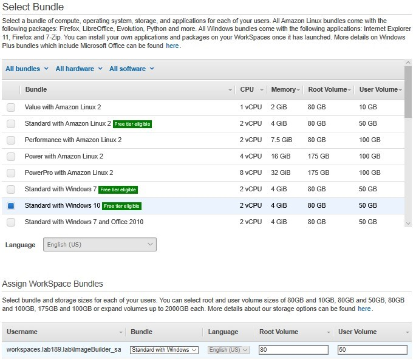

# workspaces-poc

> Tested in
> * ap-southeast-1
> * should work in other service available region

# Step 1 : Create the WorkSpaces Lab VPC network infrastructure using AWS CloudFormation 
The steps in this section will walk you through running an AWS CloudFormation script to build out a fully functioning Virtual Private Cloud (VPC) infrastructure in the selected region you choose under your AWS account in an automated fashion.

| Components | Value |
| ------------- | ------------- |
| VPC Name  | WorkSpaces VPC  |
| VPC IPv4 CIDR block   | 10.X.0.0/16   Where X is your choice (0-255)  |
| Public subnet name  | WorkSpaces Public Subnet  |
| Public subnet IPv4 CIDR  | 10.X.0.0/24  (Where X is the value you choose for the VPC CIDR above)  |
| Private subnet 1 name | WorkSpaces Private Subnet1 |
| Private subnet 1 IPv4 CIDR | 10.X.1.0/24   (Where X is the value you choose for the VPC CIDR above) |
| Private subnet 2 name | WorkSpaces Private Subnet2 |
| Private subnet 2 IPv4 CIDR | 10.X.2.0/24   (Where X is the value you choose for the VPC CIDR above] |
| Internet Gateway Name |	WorkSpaces IGW  |
| NAT Gateway |	WorkSpaces NatGateway  |
| WorkSpaces Public Route Table |	FYI-Routes Public subnet internet traffic to the Internet Gateway. |
| WorkSpaces Private Route Table |	FYI-Routes Private subnet internet traffic to the NAT Gateway.  |

# Step 2 : Create an AWS Directory Service
Amazon WorkSpaces requires an AWS Directory Service store to facilitate WorkSpace and user information for authentication and management purposes. The Amazon WorkSpaces managed service can create this directory in the cloud for you using either Simple AD  or AWS Managed Microsoft AD. Additionally, you can connect to an existing Active Directory using the Active Directory Connector (or AWS Managed Microsoft AD via a standard domain trust) through the AWS Directory Services console. 

| Option | Value |
| ------------- | ------------- |
| Directory DNS Name | Workspaces.lab(X).com |
| Directory NetBIOS Name | "Workspaces" |
| Directory Description | An AWS MMAD instance used for the workspaces.lab(X).com lab domain. Created by your name with date. |
| Admin Password | The password for directory administrator |
| Confirm Password | retypr password to confirm |

Review the summary of the directory information that is presented and make any necessary changes. When the information is correct. 

# Step 3 : Launch an initial WorkSpace to build a custom image
Once the Directory is set up, you are able to provision a WorkSpace via the console. In this section, we are going to create a new user in our MMAD directory, launch an initial 
WorkSpace for that new user, connect to that instance and install business applications. Once configured, the WorkSpace will then be used to create a custom image for the purposes of provisioning additional WorkSpaces for our other end users. 

On the Enable **Self Service Permissions** prompt with leaving the **Yes** option button selected, and then choose Register again to begin the directory registration process.

It takes a few (3 to 5) minutes for the registration process to complete. Once it has successfully registered the registered value changes to “YES”. 

*Launch WorkSpaces*

Select the AWS Managed Microsoft AD directory (workspaces.labXXX.lab) you created in the previous section from the Directory dropdown and then choose Next Step.
9.	You can now either add users to your directory or select from existing users if you add previously created some or are connected to an Active Directory. Since we just created this directory, you will need to create at least one user. 

The first WorkSpace we are going to provision will be used to create a custom image for subsequent deployments to your end users. As such, we are going to create a “service” account in the directory for this purpose.  

**Email Note**: It’s important to use a valid email address where you can receive email so that you can receive the one-time activation link. In order for this user account to become active, you need to set a password by following the instructions on the activation page. If you don’t use a valid email address, you’ll need to retrieve the registration link from the console. 

Next, you will assign a WorkSpaces Bundle  to the user you just created. For this lab, select the Standard with Windows 10 bundle. This automatically assigns that bundle to the user you created in the last step.

