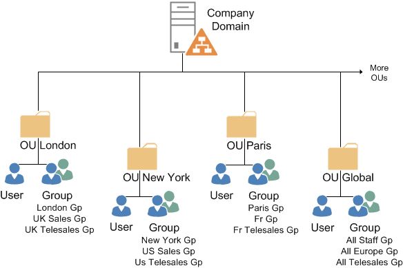
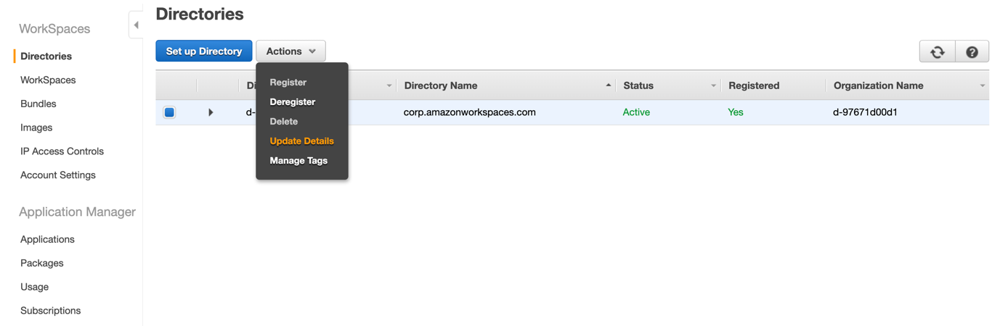
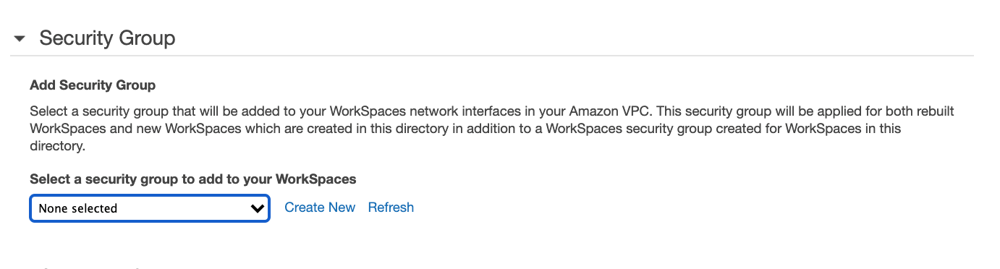
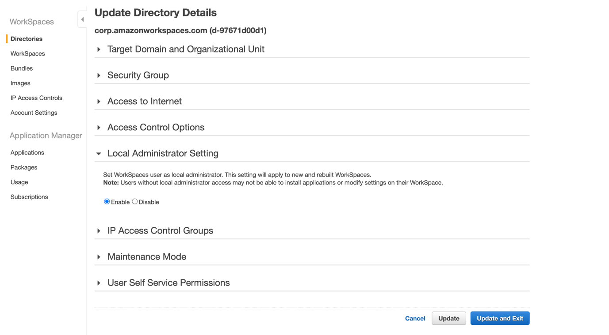
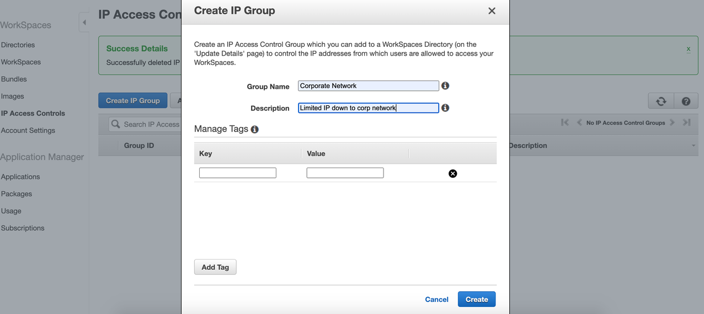

# WorkSpaces Security

As part of the shared responsibility model, security is a shared responsibility between Amazon Web Services (AWS) and you. AWS is responsible for protecting the infrastructure that runs the AWS services while you are responsible for securing your data in AWS through appropriate permissions and WorkSpace management as outlined in the Best Practices for Deploying Amazon WorkSpaces whitepaper. 

# Before Start
*Define User Group*
How you define your user groups should reflect how you classify your data and the access controls associated with the classifications. A common approach is to begin by separating your internal (employees) and external (vendors and consultants) users. The identification process also helps to ensure that you’re following the principle of least privilege by limiting access to certain applications or resources. These user groups are the building blocks for designing the rest of your security controls, including the directories, access controls, and security groups.

*Configure Active Directory*

Amazon Workspaces can create and manage a directory for you so that users are entered into that directory when you provision a WorkSpace. As an alternative, you can integrate WorkSpaces with an existing, on-premises Microsoft Active Directory (AD) so your users can use the credentials they already know to access applications.

Within Amazon WorkSpaces, directories play a large part in how access to workspaces is configured. Directories within Amazon WorkSpaces are used to store and manage information for your WorkSpaces and users. Based on the preceding two example user groups, let’s split your users’ WorkSpaces across two directories. That will help you to establish different access control settings for the two groups.

# Step 1: To establish and configure security groups

In the Amazon WorkSpaces menu, select Directories from the left menu. Choose the directory you created for your external users. Select Actions and then Update Details as shown in the following figure.

In the Update Directory Details screen that appears, select the down arrow next to Security Group to expand the section. Select Create New next to the dropdown menu to configure a new security group.

# Step 2: Disable local administrator rights

1. In the Amazon WorkSpaces menu, select Directories from the left menu. Choose the directory you configured for your external users.
2. Select Actions and then Update Details.
3. In Update Directory Details, select Local Administrator Setting and choose the Enable radio button.
4. Select Update and Exit as shown in the following figure.

# Step 3: Define IP access control

1. Inside the Amazon WorkSpaces page, select IP Access Controls on the left panel. Select Create IP Group and enter a Group Name and Description in the window that appears.
2. Select Create as shown in the following figure.
3. Select the box next to the IP group you just created to open the new rules form.

4. Select Add Rule.
5. Enter the individual IP addresses or CIDR IP ranges that you want to allow WorkSpaces to have access from in Source. If you want to restrict access to your VPN make sure to add the public IPs of the VPN. Enter a description in Description.
6. Select Save as shown in the following figure.
